# GenreClassification project

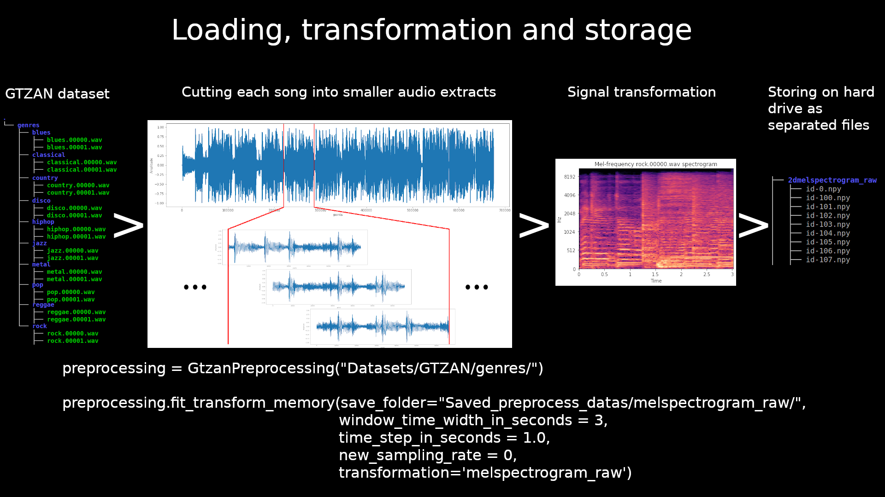

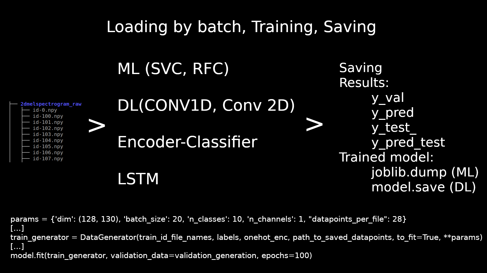

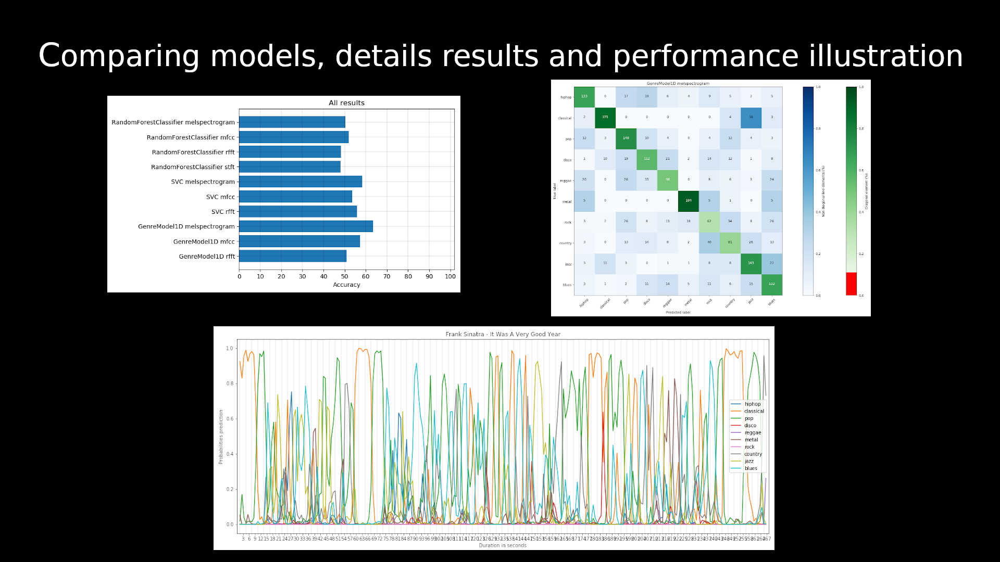

## Project progress

I want to investigate how combinaison of differents models and audio transformation impact genre classifcation task. For this, I selected various deep learning model and audio transformations type that are used for this type of task. I use ML model for base performance comparaison. 

First part of this project aim to developp a pipe allowing me to try easily all approachs I wanted:
 
- Preprocessing dataset: data augmentation with differents poarameters, differents transformations with differents transformations parameters)

- Handle limited memory capacity: for high resolution transformation and raw signals it's impossible to load all datapoints at once so I had to load batch from hard drive.

- Sanity check: When I work on human skilled task, I like to analyse the model behaviour on data I know well and that are not from the original dataset. So I can have more intuitive feedbacks. 

Second part focused training models, first one transformed signals than in raw signals. 

Third part optimization of the most efficient approach.

## Project task list

Transformed signals

- [X] Machine Learning (SVC, RFC) on transform signals
- [X] Convolution network 1D on transform signals
- [X] Convolution network 2D on transform signals (spectrogram)

Raw signals

- [ ] Convolution network 1D on raw signals
- [ ] Encoding classifier
- [ ] LSTM 

## Project Plan
1. Data description
2. Preprocessing
    1. Data augmentation
    2. Subsampling
    3. Memory management
    4. Code structure
3. Differents signal approachs
4. Results
5. Discussion: Approachs comparaison

## Learn and reinforced skilled
- Using keras Sequence for specific batch loading
- Trained and optimization of 1D and 2D Convolutional Neural Network

## 1. Data description

GTZAN database  
1000 audio extracts (30 seconds)  
10 audio genres 100 of each **[** **blues**, **classical**, **country**, **disco**, **hiphop**, **jazz**, **metal**, **pop**, **reggae**, **rock** **]**  
sample rate at 22,050Hz  
661,500 points per song (22,050s-1 x 30s)

## 2. Basic Preprocessing

Audio genre identification is not a trivial task, there is very low chance that 1000 datapoints will be enough (even if it is just link to the proportion of frequencies in the extract). 
My personal experience tells me that the variability in one genre needs at far more datapoint than a hundred per class.
My first concern is to augment the number of datapoints.

### a. Data augmentation
I evaluate that the minimal duration to identify an extract genre is between 3 and 5 seconds long. 
From one 30 seconds songs extracts, I make 10 short extracts (3 seconds) [1+(extract duration - window length) / window step )].  
Rolling window of 3 seconds with 3 second step.  
**1,000 audio extracts -> 10,000 small audio extracts**

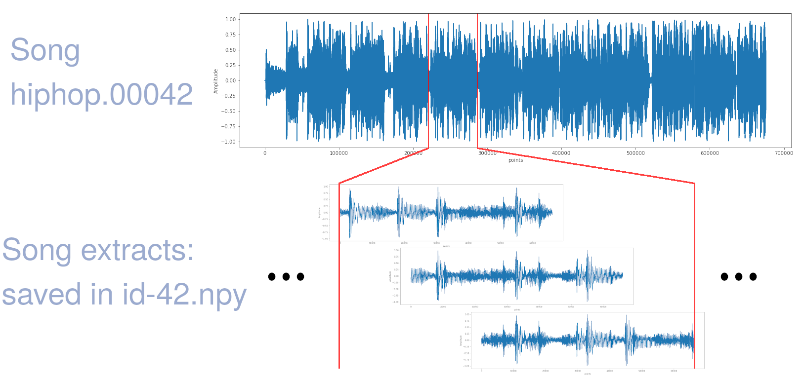

### b. Subsampling

**For now, I don't use subsampling** but I implemented it in the pipe because I want to investigate its impact. 

### c. Memory management

Training IA model in a personal computer is limited by the computing power but very quickly random access memory become the bottleneck of this procedure. To pass through this difficulty, I use a custom DataGeneration class so datapoints are loaded from disk by batch. I use the DataGenerator class (found at https://stanford.edu/~shervine/blog/keras-how-to-generate-data-on-the-fly) and modify it to fit my particular need (loading song, unwrapping song extract and corresponding labels). 

A song with no resampling, 3 seconds extracts and 3 seconds rolling window step is saved as an array of arrays of shape (10, 66150): 

    array([[ 0.0000000e+00,  0.0000000e+00,  0.0000000e+00, ...,
            -8.8073730e-02, -6.0546875e-02, -2.2003174e-02],
           [ 9.3688965e-03,  1.4282227e-02,  1.9165039e-02, ...,
             4.5623779e-02, -3.1677246e-02, -4.1595459e-02],
           [ 1.2207031e-04,  4.6081543e-03,  1.2054443e-02, ...,
             1.7822266e-02, -9.6435547e-03,  6.7138672e-03],
           ...,
           [ 1.5502930e-01,  2.2491455e-01,  1.5032959e-01, ...,
             1.4706421e-01,  1.6232300e-01,  1.6098022e-01],
           [-2.0800781e-01, -2.1649170e-01, -2.1429443e-01, ...,
            -1.8310547e-02, -1.7242432e-02, -1.5808105e-02],
           [-1.4434814e-01, -1.3574219e-01, -1.1437988e-01, ...,
            -1.2930298e-01, -1.2954712e-01, -1.4031982e-01]], dtype=float32)
           
For each transformation, I make a folder containing 1001 files (one per song plus labels: a dict with file name as key and label as target ex: label.get("id-42") return "hiphop", that allow loading only target for splitting). 
For example, 2dmelspectrogram signals are saved in "Saved_preprocess_datas/2dmelspectrogram/" that contains files (id-0.npy to id-999.npy and labels.npy).

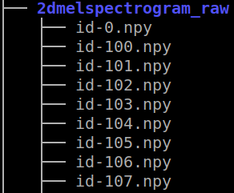

### d. Code structure

All pipeline, use four main functions:
- GtzanPreprocessing (create and store on disk preprocessed datas)
- DataGenerator (create a generator that load datapoints form hard drive)
- Train_signal_approachs (carry training procedure for preprocess data type and model given)
- Illustration (show probability prediction for one song, using one approach with same preprocessing and loaded trained model)

##### GtzanPreprocessing

I choose to use a class called GtzanPreprocessing.
This allows me to simply try different preprocessing choice just by calling: 

    preprocessing = GtzanPreprocessing("Datasets/GTZAN/genres/")

    preprocessing.fit_transform(save_folder="Saved_preprocess_datas/no_resampled/",
                                window_time_width_in_seconds = 3,
                                time_step_in_seconds = 3.0,
                                new_sampling_rate = 0)
                                                             
Or even, using already resampled dataset save on hard drive to try different transformations without losing time:

    preprocessing = GtzanPreprocessing("Datasets/GTZAN/genres/")

    transfo = "2dmelspectrogram_raw"
    preprocessing.fit_transform(save_folder="Saved_preprocess_datas/"+transfo+"/",
                                path_to_resampled_dataset = "Saved_preprocess_datas/no_resampled/",
                                transformation = transfo)
                                       
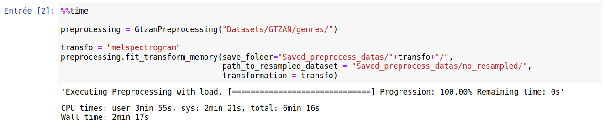

##### DataGenerator

To load data in keras model, I use a class that generate datas on model training, the class is called DataGenerator, it take parameters (datapoints_per_file was added to original code to fit the wrapping extract specific needs): 

    # Parameters
    params = {'dim': (128, 130),
              'batch_size': 4,
              'n_classes': 10,
              'n_channels': 1,
              'shuffle': False,
              "datapoints_per_file": 28}
              
Then I call in training function:

    ...
    validation_generator = DataGenerator(validation_id_file_names, labels, onehot_enc, path_to_saved_datapoints, to_fit=True, **params)
    ...
    
OneHotEncoder is fitted with a GTZAN genres list than used at each call of DataGenerator and more generally in all training function

##### Training function

The training function take at least 4 parameters, DataGenerator is called within it. For now, I use two differents functions to train deeplearning model (keras) and machine learning model (scikit-learn).

    y_val, y_pred_val, y_test, y_pred_test = train_model_val_test_generated_datas(
                                                GenreModel2D, 
                                                "Saved_preprocess_datas/"+data_type+"/", 
                                                params,
                                                epochs=100)

## 3. Differents signal approachs

Reading publications about signal approach in machine learning, I identified at least four approachs using differents audio transformations and model architectures.

### A. Signal transformations

The representation of datapoints given by this transformation depend on parameters take can be tune such as number of window, final resolution or window step. I want to investigate transformation parameters impact (mainly transformation resolution).

- Fourier transform
>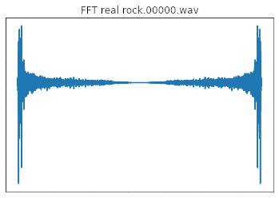

- Short time fourier transform (stft) 
>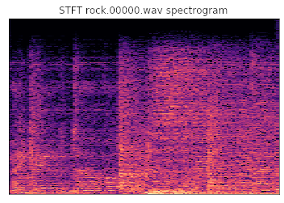

- Mel-frequency cepstral coefficients (mfcc)
>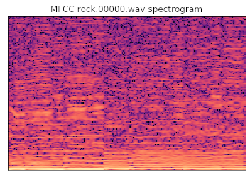

- Melspectrogram
>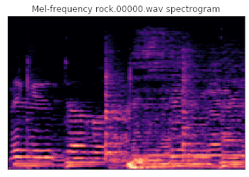

### B. Models

**Random Forest Classifier and Support Vector Classifier**
    
- Using Machine Learning Models as base performance comparaison.

**Convolutional Neural Network (1D and 2D (on spectrogram))**

- Mainly used on image and natural language processing, it is also used on time series.

**Long Short Time Memory**

- Recurrent Neural Network (RNN) known to perform well in time series, I want to see how it behave with genre classification.

**Encoder-Classifier**

- Since signals transformation used in this project can be seen as signal representation well-suited for audio recognition task. I want to see how signal encoding (through autoencoder) can impact genre classification task. 

### C. Approachs

|Transformed signals|Raw signals|Models|
|:-----------------:|:---------:|:-----|
|Yes                |No         |Machine Learning model (RFC and SVC)|
|Yes                |Yes        |Convolutional Neural Network|
|No                 |Yes        |Autoencoder -> Encoder part (frozen) + final classification layer|
|No                 |Yes        |Long Short Time Memory|

## 4. Results 

#### All already obtain Classifier results on test dataset

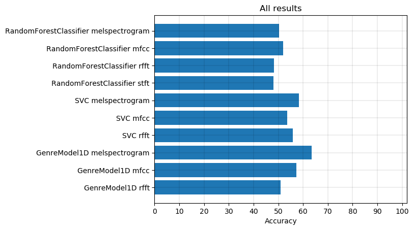

#### SVC Melspectrogram Confusion Matrix on test dataset

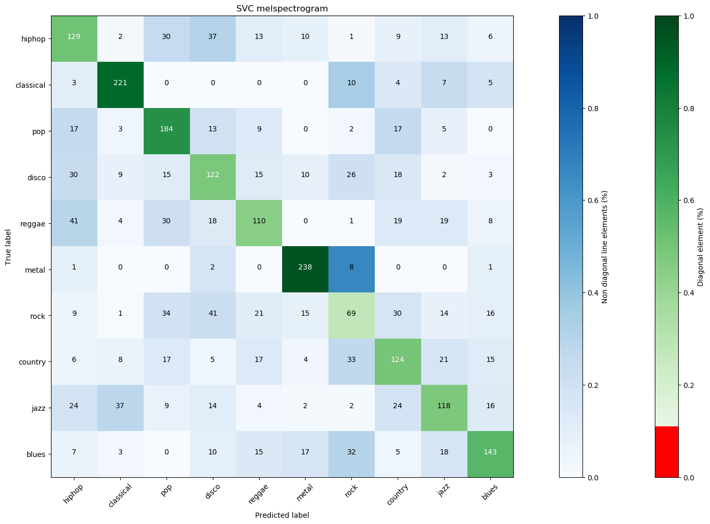

#### GenreModel1D Melspectrogram Confusion Matrix on test dataset

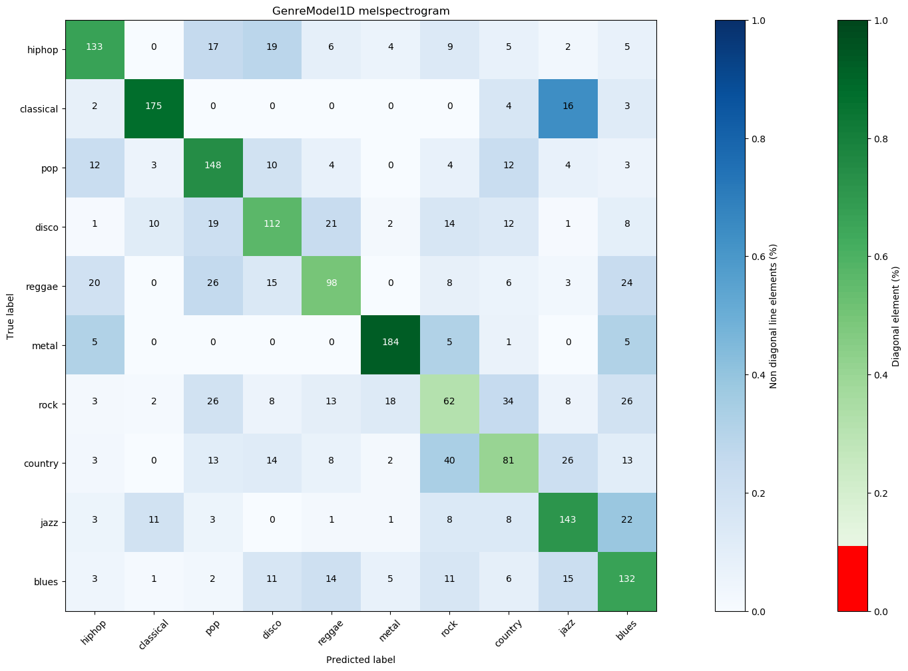

## 5. Discussion: Approachs comparaison

The first results show that the best transformation could be melspectrogram or mfcc. 
Looking at confusion matrix, for the two best accuracy scores, both model shows a similar behaviour. Same performance per class, with best performance for classical and metal classification and worst performance for rock classification.

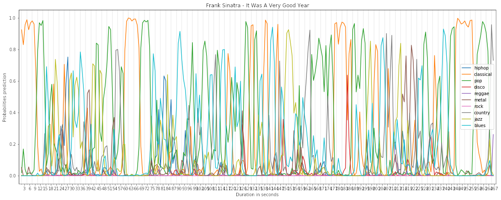

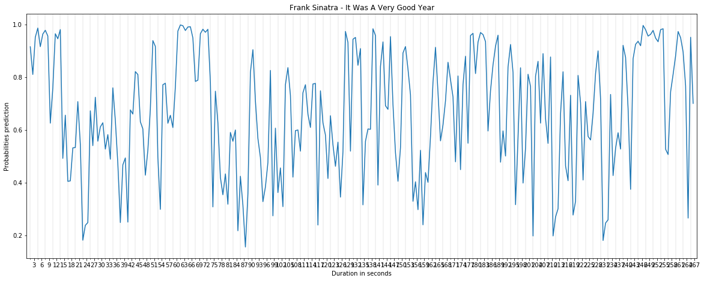
This song 
